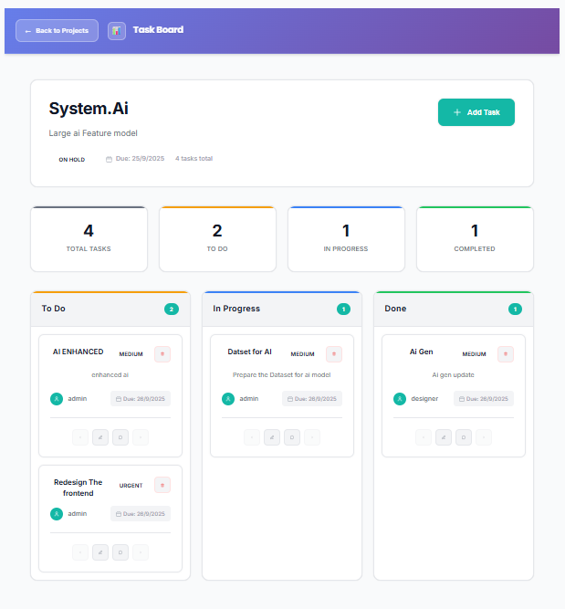

# 🗂️ **Mini Project Management System**

A simplified multi-tenant project management tool built with **Django (GraphQL backend)** and **React (Apollo frontend)**.

This app allows organizations to manage projects, tasks, and team collaboration through comments — with tenant isolation and a clean UI.

---

## 📌 **Features**

### ✅ Core

* Multi-tenant organizations (X-Organization header)
* Projects: create, list, view details
* Tasks: create, update, board view (Todo → In Progress → Done)
* Comments: add and view per task

### 🎯 Extras

* Completion statistics per project
* Task priorities and due dates
* Project and task forms (with validation)
* Delete operations for projects and tasks

---

## 🚀 **Tech Stack**

* **Backend**: Django, Graphene (GraphQL), PostgreSQL
* **Frontend**: React, Apollo Client, TypeScript, CSS
* **Database**: PostgreSQL (Docker/local)

---

## ⚙️ **Setup**

### 1. Clone Repository

```bash
git clone https://github.com/your-username/mini-pm-system.git
cd mini-pm-system
```

### 2. Backend Setup

```bash
cd backend
python -m venv venv
source venv/bin/activate    # (Linux/Mac)
venv\Scripts\activate       # (Windows)

pip install -r requirements.txt

# Run migrations
python manage.py makemigrations
python manage.py migrate

# Start server
python manage.py runserver
```

Backend runs at: [http://127.0.0.1:8000/graphql/](http://127.0.0.1:8000/graphql/)

### 3. Frontend Setup

```bash
cd frontend
npm install
npm run dev
```

Frontend runs at: [http://localhost:5173/](http://localhost:5173/)

---

## 🔑 **Usage**

### Example GraphQL Query (Projects)

```graphql
query {
  projects {
    id
    name
    status
    dueDate
    taskCount
    completedTasks
  }
}
```

---

## 🖥️ **Screenshots**

### 📌 Project Dashboard


### 📌 Task Board



---

## 📊 **Technical Summary**

**Architecture**

* Backend: Django + Graphene GraphQL with PostgreSQL
* Frontend: React + Apollo Client for GraphQL integration
* Multi-tenancy enforced via organization header middleware

**Decisions & Tradeoffs**

* Used GraphQL for flexible queries instead of REST
* Focused on CRUD completeness over advanced features
* Skipped WebSockets/real-time for simplicity (possible future improvement)

**Future Improvements**

* Real-time subscriptions for comments/tasks
* Drag-and-drop Kanban board
* More advanced filtering/search
* Docker containerization for deployment

---

## 👨‍💻 **Author**

Darshan S – [darshanpoojary980@gmail.com](mailto:darshanpoojary980@gmail.com)
